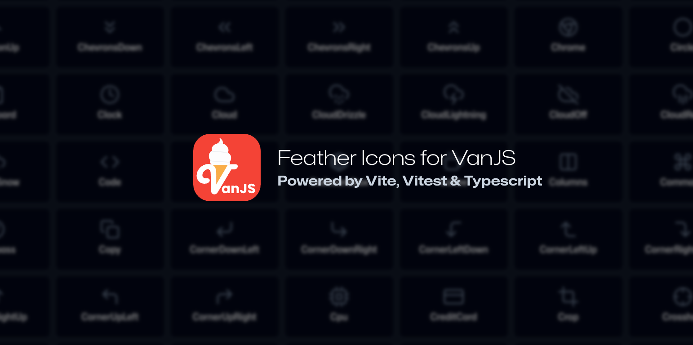

# vanjs-feather

[](https://coveralls.io/github/thednp/vanjs-feather)
[](https://github.com/thednp/vanjs-feather/actions/workflows/ci.yml)
[](https://www.npmjs.com/package/vanjs-feather)
[](https://www.typescriptlang.org/)
[](https://www.vitest.dev/)
[](https://vitejs.dev/)

[](https://thednp.github.io/vanjs-feather)


Feather icons for [VanJS](https://vanjs.org).

Powered by:

- [Vite](https://vitejs.dev) and [tsup](https://tsup.egoist.dev/) for tooling
- [Vitest](https://vitest.dev) for unit tests
- [TailwindCSS](https://tailwindcss.com) for demo styling
- [VanJSConverter](https://github.com/vanjs-org/converter) for generating the source code

## Installation

  **Install with npm**:
   ```bash
   npm install vanjs-feather
   ```

  **Install with pnpm**:
   ```bash
   pnpm install vanjs-feather
   ```

  **Install with yarn**:
   ```bash
   yarn add vanjs-feather
   ```

## Usage

   **Basic Usage**
   ```ts
   import van from "vanjs-core";
   import { Activity } from "vanjs-feather";
   const { main } = van.tags;

   const App = () => {
      return main({},
         Activity({ class="icon", style="color: turquoise" });
      );
   };

   van.add(document.body, App());
   ```

   **Properties**
   * `id`: *string | undefined* - sets an *id* **non-state** attribute for your icon, *default: ""*
   * `class`: *string | undefined* - sets a *class* **state** for your icon, *default: ""*
   * `style`: *string | undefined* - sets a *style* **state** for your icon, *default: ""*
   * `stroke`: *string | undefined* - sets a *stroke* **state** for your icon, *default: currentColor*
   * `strokeWidth`: *number | undefined* - sets a *stroke-width* **state** for your icon, *default: 2*
   * `width`: *number | undefined* - sets a *width* **state** for your icon, *default: 24*
   * `height`: *number | undefined* - sets a *height* **state** for your icon, *default: 24*

Since the feather library adds color to icons via the `stroke` property, any text `color` value inherited from parent elements would apply to your icons.

The `width` and `height` properties can change the scale of the icons, something you may not want when using custom `style` and / or `class`.

## License

**VanJS Feather** is released under the [MIT License](https://github.com/thednp/vanjs-feather/blob/master/LICENSE).
